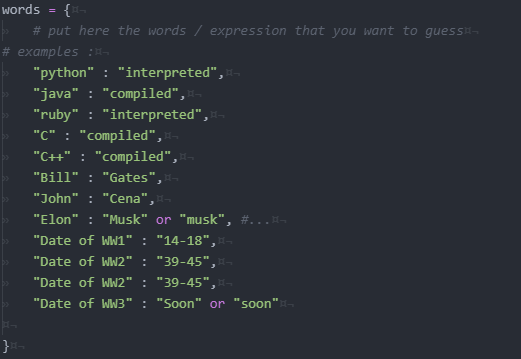
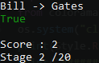

<h3 align="center">Quizz-Maker</h3>
<p align="center">
    Quizz-Maker is a little script in python to create his own quizz with dictionary.
    <br>
    
## About the project


    
## Built With
* [Operator](https://docs.python.org/3/library/operator.html)
* [Colorama](https://pypi.org/project/colorama/)
* [Random](https://docs.python.org/3/library/random.html)

## Getting started
To get a local copy up and running follow these simple steps.
    
### Prerequisites
You need to install Python, that can be done [here](https://www.python.org)
### Installation
1. Clone the repo
   ```sh
   git clone https://github.com/KursK-sys/Quizz-Maker.git
   ```
2. Install Python packages
   ```sh
   # Windows:
   py -3 -m pip install -r requirements.txt
   
   # Unix
   python3.8 -m pip install -r requirements.txt
   ```
   
#### Or this can be done using android with unrooted Termux
```
git clone https://github.com/KursK-sys/Quizz-Maker.git
pkg install python
pip install -r requirements.txt
cd Quizz-Maker
python3 quizz-maker.py
```
    
## Usage
In first  edit the dictionnary to create your own quizz, 
    

    
 The user will be queried on the right column based on the left column
    
 **Exemple**
    
  
 
    
 There are 20 questions
    
->In training mode the answer is given if the user is wrong
   
